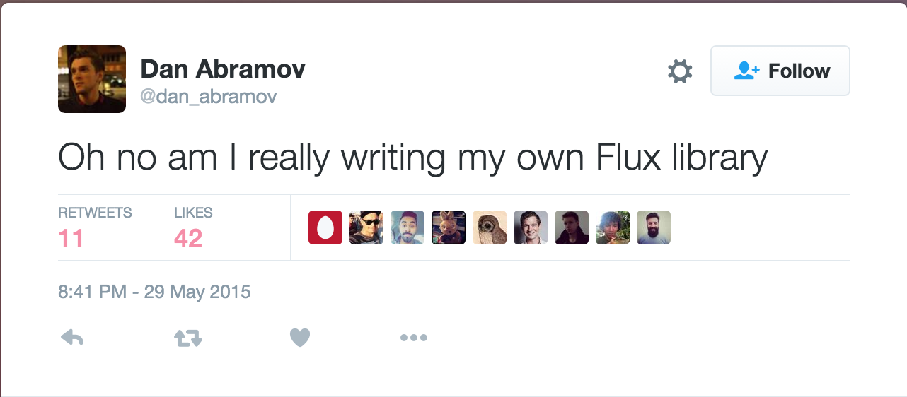

<!-- .slide: data-background="img/background-orange-orig.jpg" -->

# Intro
---

<!-- .slide: data-state="flux" data-background-size="100%" data-background="img/redux-github.png" -->

---

### Redux
1. Creator: *[Dan Abramov](https://github.com/gaearon)*
1. Public traction since [React Europe 2015](https://www.react-europe.org/2015/2015.html)
1. Current Version: 3.5.1

---

[Link](https://twitter.com/dan_abramov/status/604356871722569728)

---

### Flux Libraries
<small>The popular ones...</small>

    Flummox
    Alt
    Fluxxor
    Flux This
    MartyJS
    McFly
    Fluxible
    Delorean
    Lux
    Reflux
    OmniscientJS
    Fluxy
    Material Flux
    Redux
 

---

## Flux Architecture
<!-- .slide: data-state="flux" data-background-size="100%" data-background="img/flux-diagram-white-background.png" -->

---

### Motivation
1. Code must manage more state than ever before
1. Easy to get lost when, why and how a state gets modified
1. Mixing of two concepts: mutation and asynchronicity
  
### => Redux attempts to make state mutations predictable
 
 
<small>Source: [www.redux.js.org](http://redux.js.org/docs/introduction/Motivation.html)</small>
